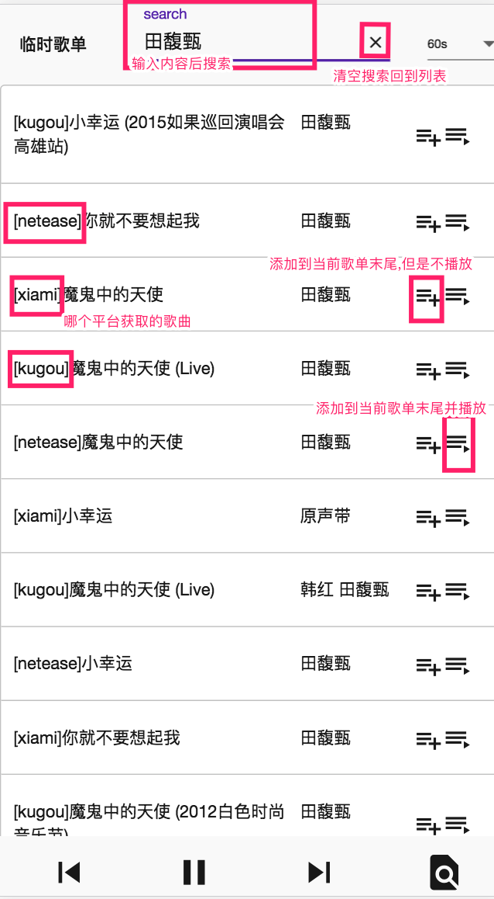

# Music Player

[在线试用](https://music.xinshangshangxin.com/)

## 界面说明

## 目录说明

### [api](./api)

支持 酷狗/网易/虾米 音乐获取

### [backend](./backend)

基于 `nestjs` 调用 `@s4p/music-api` 提供 `graphql` 接口的后台服务

### [frontend](./frontend)

基于 `Angular 6` 提供简易的界面

### [proxy](./proxy)

提供跨域歌曲 URL

### [nmdb](./nmdb)

提供 [mongodb](https://github.com/mongodb/mongo) 和 [nedb](https://github.com/louischatriot/nedb) 以相似接口

## TODO

- [ ] 歌曲进度调整
- [ ] 歌词显示
- [ ] 完整 `docker` 镜像 build
- [ ] 完善桌面浏览器下界面样式
- [ ] `Electron` 构建桌面应用
- [ ] 音量调整
- [ ] 设置界面, 添加渐近渐出,排行榜隐藏等配置
