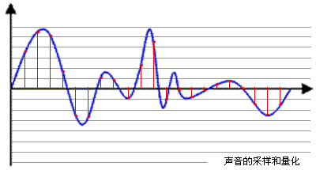

# Music Player

[在线试用](https://music.xinshangshangxin.com/)

## [4.x 版本](https://github.com/xinshangshangxin/music/tree/4.x)

[4.x](https://github.com/xinshangshangxin/music/tree/4.x)

## 目录说明

### [api](./api)

支持 酷狗/网易/虾米 音乐获取

### [backend](./backend)

基于 `nestjs 6` 调用 `@s4p/music-api` 提供 `graphql` 接口的后台服务

### [frontend](./frontend)

基于 `Angular 8` 提供简易的界面

### [proxy](./proxy)

提供跨域歌曲 URL

## Q&A

### 最 `high` 部分如何实现

**基础解释:**[(原文)](http://blog.jianchihu.net/pcm-volume-control.html)

> 声音是介质振动在听觉系统中产生的反应。声音总可以被分解为不同频率不同强度正弦波的叠加（傅里叶变换）

> 声音有两个基本的物理属性: 频率与振幅。声音的振幅就是音量，频率的高低就是指音调，频率用赫兹（Hz）作单位。人耳只能听到 20Hz 到 20khz 范围的声音

**数字音频:**[(原文)](https://blog.csdn.net/ljxt523/article/details/52068241)

> 通过采样和量化技术获得的离散性（数字化）音频数据。计算机内部处理的是二进制数据，处理的都是数字音频，所以需要将模拟音频通过采样、量化转换成有限个数字表示的离散序列（即实现音频数字化）

**PCM 数据由以下几部分组成:**

> 1. `Sample Rate`: 采样频率(采样率), 记录声音时每秒的采样个数(如: 44.1kHz 表示 1 秒钟的采样数据点是 44100 个)
> 2. `Sign`: 音频数据是否是有符号的
> 3. `Sample Size`: 采样精度(位深度). 记录声音的动态范围,位(bit)为单位, 通常该值为 16-bit
> 4. `Byte Ordering`: 音频数据的存储字节序
> 5. `Number of Channels`: 声道数(单声道 1 channel, 立体声 2 channels)

**最 `high` 部分可以理解为音量最高的部分, 也就是振幅最高部分, 所以可以通过获取通道的 PCM 数据, 通过振幅的大小(也就是 `channelData` 中绝对值大小) 来判断声音最高部分**

**代码文字描述:**

> - `fetch` 获取歌曲, 通过 [`Body.arrayBuffer()`](https://developer.mozilla.org/en-US/docs/Web/API/Body/arrayBuffer) 获取 `arrayBuffer`(用来表示通用的、固定长度的原始二进制数据缓冲区)
> - 用[`AudioContext.decodeAudioData(arrayBuffer)`](https://developer.mozilla.org/en-US/docs/Web/API/BaseAudioContext/decodeAudioData)获取 [`audioBuffer`](https://zh.wikipedia.org/wiki/%E8%84%88%E8%A1%9D%E7%B7%A8%E7%A2%BC%E8%AA%BF%E8%AE%8A)(表示 decodedData, PCM 脉冲编码调制的音频编码格式数据)
> - [`audioBuffer.getChannelData(0)`](https://developer.mozilla.org/en-US/docs/Web/API/AudioBuffer/getChannelData)(包含与通道关联的 PCM 数据, 0 表示第一个通道)
> - 通过 `channelData` 计算 X 秒时间内,`channelData` 绝对值累加最高的是哪一段, 这一段就是最 `high` 的部分(实际处理的时候, 进行了取样, 来减少数据传输量)

**代码位置:**
[audio-peak.ts, L7-L30](https://github.com/xinshangshangxin/music/blob/develop/frontend/src/app/rx-audio/audio-peak.ts#L7-L30)

### `4.x` 和 `5.x` 区别

- 使用 `angular 8` 和 `nestjs 6` 实现
- 后端使用 `typeorm` 代替 `nmdb`
- 前端重写 `RxPlayer`, 以实现预先载入下一首歌曲

## TODO

- [ ] 实现相比 `4.x` 缺失的内容
